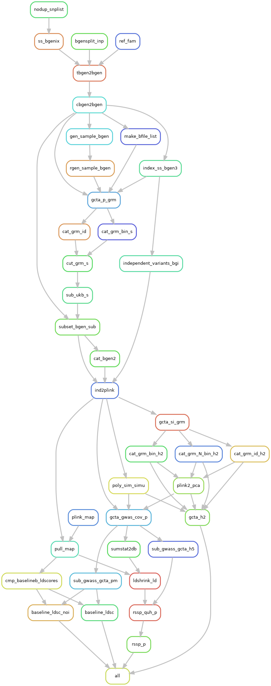

# PolygenicRSS

# Configuration

first, download the repo do a directory of your choosing, then `cd PolygenicRSS/workflow`.  You will find an elaborate `config_base.yaml`.
You may find it useful to modify this file to run the pipeline outside of `cri`.

## Simulating GWAS

To simulate GWAS you'll need genotypes, and if you're using the UK biobank you'll want to use a subset of the genotype data.  
